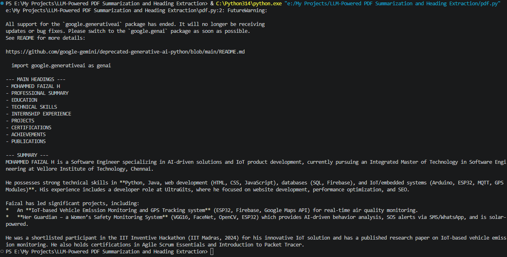

# LLM-Powered PDF Summarization and Heading Extraction
LLM-powered PDF summarization tool using Gemini 2.5 Flash and PyMuPDF. Extracts text, identifies document headings, and generates concise summaries from PDF files. Features regex-based heading detection for efficient document understanding and analysis.

## 🚀 Features

- 📄 Extract text from PDF documents
- 📝 Detect document headings using Regex patterns
- 🤖 Generate summaries using Gemini 2.5 Flash
- 🔒 Secure API key management with `.env`
- ⚡ Fast and lightweight implementation in Python

## 🛠️ Tech Stack

- Python
- PyMuPDF
- Google Gemini API
- python-dotenv

## 📂 Project Structure

```text
LLM-Powered-PDF-Summarization-and-Heading-Extraction/
│
├── Sample_pdfs/
├── pdf.py
├── pdf1.py
├── requirements.txt
├── .gitignore
├── .env
├── assets/
│   └── output.png
└── README.md
```

## 📦 Installation

Clone the repository

```bash
git clone https://github.com/yourusername/LLM-Powered-PDF-Summarization-and-Heading-Extraction.git
cd LLM-Powered-PDF-Summarization-and-Heading-Extraction
```

Install dependencies

```bash
pip install -r requirements.txt
```

Create a `.env` file

```env
GEMINI_API_KEY=your_api_key_here
```

Run the project

```bash
python pdf.py
```

## 🖼️ Sample Output



## 📌 Example Output

- Extracted Headings
- PROFESSIONAL SUMMARY
- EDUCATION
- TECHNICAL SKILLS
- INTERNSHIP EXPERIENCE
- PROJECTS
- CERTIFICATIONS
- ACHIEVEMENTS
- PUBLICATIONS

Generated Summary:
> Gemini generates a concise summary of the uploaded PDF document, enabling efficient document understanding and analysis.

## ⭐ Future Enhancements

- Streamlit-based Web Interface
- Support for Multiple PDFs
- Semantic Search using Vector Databases
- OCR support for scanned PDFs

## 📜 License

This project is open-source and available under the MIT License.